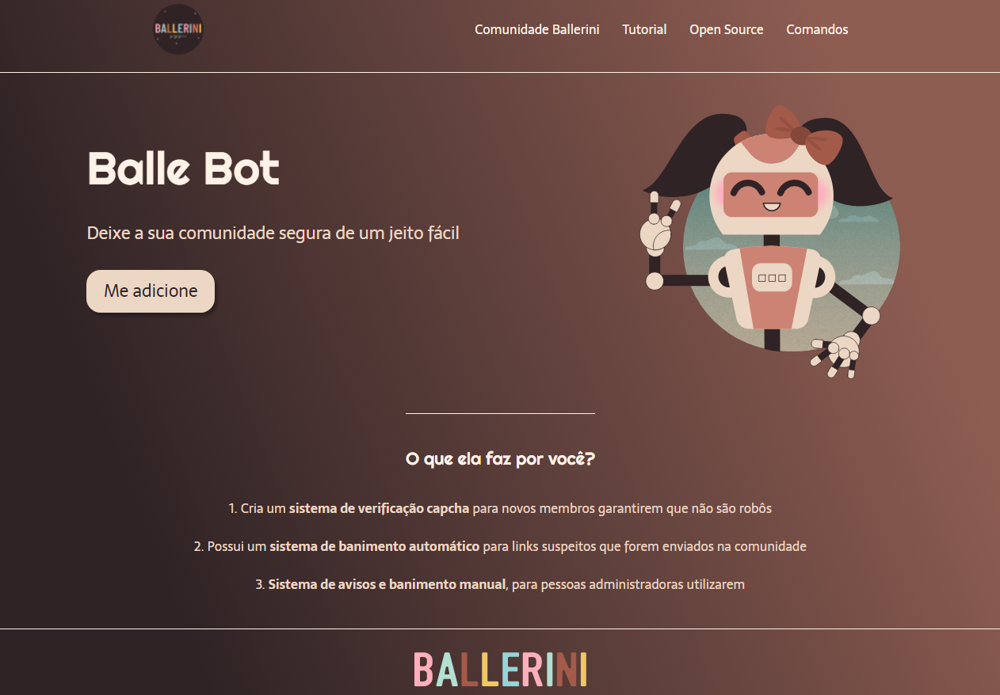

# Landing Page para bot discord

   

🇧🇷
> Landing Page criada com base em projedo da desenvolvedora Rafa Ballerini.

# :computer: Tecnologias

Essa Landing Page foi feita utilizando as seguintes tecnologias:

- [Html](https://www.w3schools.com/html/default.asp)
- [Css](https://www.w3schools.com/css/default.asp)
- [Figma](https://www.w3schools.com/css/default.asp)

 

# :pushpin: Algumans alterações

- adicionado responsividade com media query

 

## Como visualizar o projeto?
Através do link https://stehmorais.github.io/Landing_Page_Ballerini/

 

## Como funciona o projeto?
O Projeto é uma Landing Page criada para apresentar um bot do discord da comunidade Ballerini, onde a página é dividida em duas áreas, sendo uma dedicada para adicionar o Balle Bot a seu servidor com o botão de "Me adicione!" contendo na parte a direita uma imagem do negócio e na segunda área, as funcionalidades do software.

